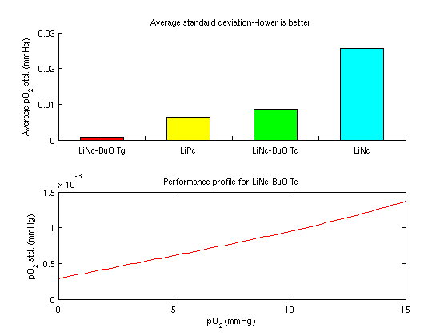
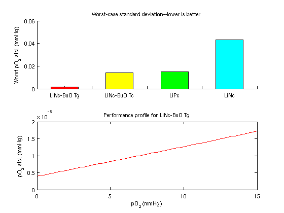

# probe_selection

This code can help you decide which probe to use for certain EPR (electron
paramagnetic resonance) oximetry experiments, based on the following paper:

J Palmer, LC Potter, R Ahmad. "Optimization of magnetic field sweep and field
modulation amplitude for continuous-wave EPR oximetry". Journal of Magnetic
Resonance, 2011.
[DOI][DOI] | [PubMed][PubMed] | [PubMed Central][PubMed Central]

[DOI]: https://dx.doi.org/10.1016/j.jmr.2011.01.013
[PubMed]: https://www.ncbi.nlm.nih.gov/pubmed/21334232
[PubMed Central]: https://www.ncbi.nlm.nih.gov/pmc/articles/PMC3086786

## Instructions

Simply copy `example.m` and modify it for your needs. It works in both MATLAB
and Octave.

## Results

The figures produced by running `example.m` in MATLAB 2011b are shown below.

### Figure 1

### Figure 2

